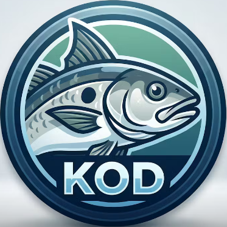

# kod

The Kubernetes Offline Deployment (kod) tool allows you to package a helm chart or helmfile and their dependencies 
and publish them to a Kubernetes cluster in an offline, air-gapped, environment.

This tool stays as close to `helm` and `helmfile` as possible, and tries not to introduce any side effects in how
it operates. It does not restrict the deployer at all by restricting namespaces, container registries. It does
not install any additional webhooks or CRD into the target Kubernetes cluster.

kod prefers the OCI container images and artifact format, but does support the legacy dockerv2 format.
`skopeo` is used for moving container images.

## Documentation

You can see our documentation in one of two places:-

- The [kod website](https://oss.bilberrysoftware.com/kod) (Preferred)
- The [./docs/docs/index.md](./docs/docs/index.md) file in this repo (latest docs, may include broken instructions)

## License and Copyright

This repository and all of its content are licensed under the Apache-2.0 License, all rights reserved.

Copyright 2026 Kod Project Contributors. The authors have asserted their moral rights.
